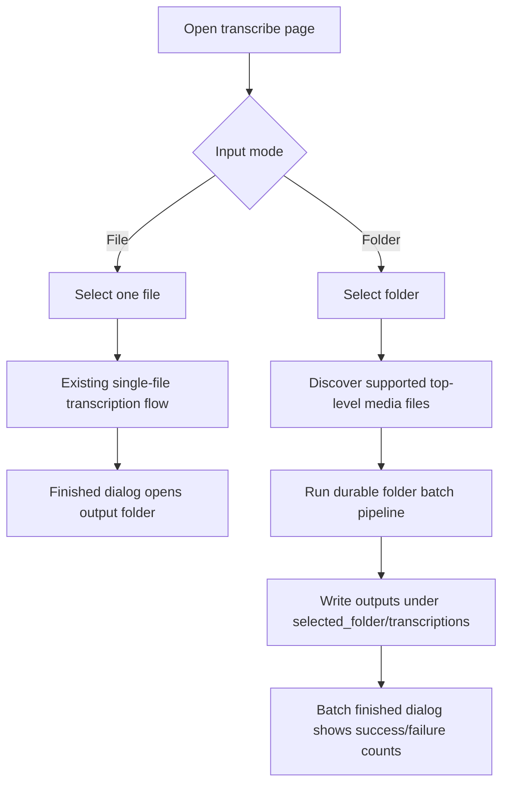
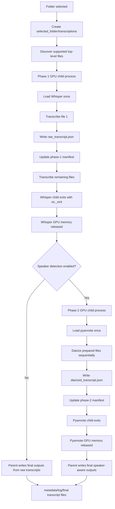

# Folder-batch transcription

This fork adds folder transcription as a durable batch workflow while preserving aTrain's existing single-file flow.

It is offered upstream as [PR #179](https://github.com/aTrainTranscription/aTrain/pull/179). This document is the public architecture note for the branch.

## Why two GPU phases

Keeping Whisper loaded is faster for a folder of files, but on GPU it can starve pyannote diarization. Folder batches therefore split the work:

1. **Phase 1 — Whisper:** load Whisper once, transcribe every supported top-level file, write `raw_transcript.json` per file, write a phase-1 manifest, then exit the child process (`os._exit(0)`).
2. **Phase 2 — pyannote:** after Whisper has exited, load pyannote once for the whole folder, diarize the prepared files sequentially, write `diarized_transcript.json`, write a phase-2 manifest, then exit.

This is folder-phase granularity, not one child process per file. GPU phase 2 must not regress to reloading pyannote per file.

CPU folder batches keep the Whisper-once optimization but do not use the GPU child-process split.

## User flow

## GPU batch architecture

## Artifacts and status markers

- `raw_transcript.json` — durable pre-diarization transcript
- `diarized_transcript.json` — durable post-diarization transcript
- `transcription.json` — final output; may include speaker labels
- `folder_batch_phase1_manifest.json` / `folder_batch_phase2_manifest.json`
- metadata: `transcription_status`, `diarization_status`, `output_status`

Outputs are written under the selected folder in `transcriptions/`. Discovery is top-level only; recursive traversal is intentionally not included.

Completed phase artifacts can be recovered if a GPU child exits before returning its in-memory result. Failed phase-1 folders keep metadata/log evidence instead of being deleted.

## Scope

- File vs Folder input modes in the UI
- Native folder picking on desktop; Flatpak/Linux portal directory picking where applicable
- Startup port fallback if the requested NiceGUI port is busy
- This is a contribution fork, not a competing product release
